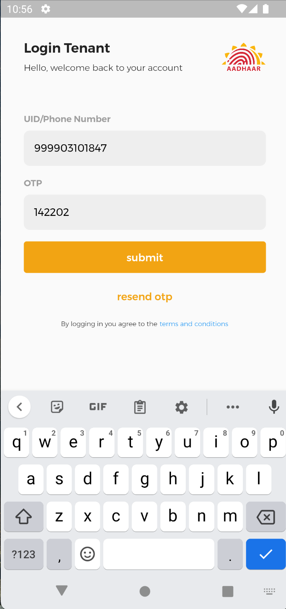

# Aadhaar Address Update in Urban Areas

## Steps to Access
To access our application you can either download the [android application]() or [click here](https://uidai-address-update.netlify.app/) to view on web.

- [Backend API Swagger Documentation**](https://uidai-aadhaar.herokuapp.com/docs)
- [Android App](https://github.com/ankithans/aadhaar-address-update/releases/download/v1.0.0/app-release.apk)
- [Web App](https://uidai-address-update.netlify.app/)

> Note : If you are on web version, Aadhaar API's(OTP and EKYC) blocks the requests due to CORS issue. Please use browser with disabled CORS and security.

**Linux**
```bash
google-chrome --disable-web-security --disable-gpu --user-data-dir=~/tem
```
**MacOS**
```bash
open -n -a /Applications/Google\ Chrome.app/Contents/MacOS/Google\ Chrome --args --user-data-dir="/tmp/chrome_dev_test" --disable-web-security
```

## Problem Statement
Address Update in Aadhaar in Urban Areas
> An innovative solution using technology that will help in overcoming your challenge to update the address.


## Approach
- Tenant will log in by using their Aadhaar Number/Staging UID which is kept encrypted via Base64 in our secure Database.
- Tenant enters Landlord’s phone number on their application and Landlord receives a request regarding request to lend their address to tenant, which can be approved or declined.
- The Request Notification is sent via SMS service as well as in app notifications.
- If landlord declines or approves the request, tenant will get notified about their request status through SMS and in App Notification.
- After getting approval, tenant gets the address and can edit the address minimally.
- The address edited by tenant and the address approved by the landlord will be validated using geocoding api.
- If the two addresses are having difference of more than 100 meters, the request will get rejected and further updates will be demanded from the Tenant.
- Else request succeeds and address of tenant will get updated successfully.

## Features
- Our solution is Multiplatform, users can use both web as well as mobile application.
- Native In App Notifications for updates on requests.
- Notifications through SMS Service for updates on requests.
- OTP and Ekyc Aadhaar API’s are integrated.
- Request can be updated or deleted by the Tenant.
Landlord can Approve/Decline the request.
- Profile Page for getting updated information as stored on Aadhaar Servers.
- Address Verification through Geocoding API’s and strict limit to distance between 2 addresses.
- Usage of BLOC Architecture, with which we capable of replacing any backend services without affecting the User Interface.
- Easy to understand Interactive UI/UX Design using color coding the requests.
- Input Validation before sending requests to servers.
- Our web and app is fully responsive, the users can run app or web in any device irrespective of its size.

## Mockups

<td></td>

<table>
    <tr>
        <td></td>
        <td></td>
        <td></td>
    </tr>
    <tr>
        <td></td>
        <td></td>
        <td></td>
    </tr>
</table>
<table>
    <tr>
        <td></td>
        <td></td>
    </tr>
    <tr>
        <td></td>
        <td></td>
    </tr>
</table>

## Tech Stack
FastAPI, Flutter, MongoDB, Twilio, Firebase Messaging, Google Fonts, Bloc Architecture, Google Maps API's, OpenCage API's, Base64 Encryption

## Contributors
- [Kartik Bansal](https://github.com/kbansal77)
- [Adit Patel](https://github.com/aditpatel01)
- [Aryamaan Pandey](https://github.com/Aryamaan23)
- [Ankit Hans](https://github.com/ankithans)
- [Sagnik Biswas](https://github.com/sbiswas2209)
